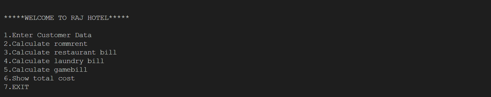
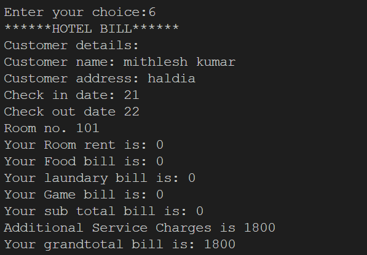

# 🏨 Hotel Management System

## 📌 Overview
This **Hotel Management System** is a Python-based console application that helps manage customer bookings, room rentals, restaurant orders, laundry services, and gaming activities. It simplifies hotel operations by calculating bills efficiently and generating a final summary.

## ✨ Features
✅ **Customer Management** – Store customer details (name, address, check-in & check-out dates).  
✅ **Room Booking & Pricing** – Users can select room types, and the system calculates the total stay cost.  
✅ **Restaurant Billing** – Customers can order food items from a menu, and the system computes the bill.  
✅ **Laundry Services** – Tracks laundry usage and calculates associated costs.  
✅ **Game Room Charges** – Provides gaming options and charges based on usage hours.  
✅ **Final Bill Generation** – Displays all expenses, including additional service charges, in a structured bill.  

---
## 📸 Screenshots

### 🏠 Main Menu


### 🏨 Room Booking


### 🧾 Final Bill


---

## 🚀 How to Run the Project

### **1️⃣ Install Python**  
Ensure you have **Python 3.x** installed. Download it from [Python.org](https://www.python.org/downloads/).

### **2️⃣ Clone or Download the Project**
```sh
git clone https://github.com/Sudhanshu-2596/hotel-management-system.git
cd hotel-management-system
```

### **3️⃣ Run the Python Script**
```sh
python HOTEL.PY
```

### **4️⃣ Follow the On-Screen Instructions**
- Enter customer details.  
- Select room type & duration of stay.  
- Order food from the restaurant.  
- Use laundry services.  
- Play games & get charges.  
- View and generate the final bill.  

---

## 📌 Requirements
✅ **Python 3.10**  
✅ No additional libraries required (uses built-in modules).  

---

## 🛠 Future Enhancements  
🔹 **GUI Support** – Add a graphical interface using Tkinter or PyQt.  
🔹 **Database Integration** – Store customer details using SQLite/MySQL.  
🔹 **Web-Based Version** – Convert it into a hotel management web app.  
🔹 **Automated Email Billing** – Send the final bill via email.  

---

## 👨‍💻 Author
👤 **Sudhanshu Raj**  
📧 Email: sudhanshuraj259@gmail.com   
🔹 GitHub: https://github.com/Sudhanshu-2596  

--- 
